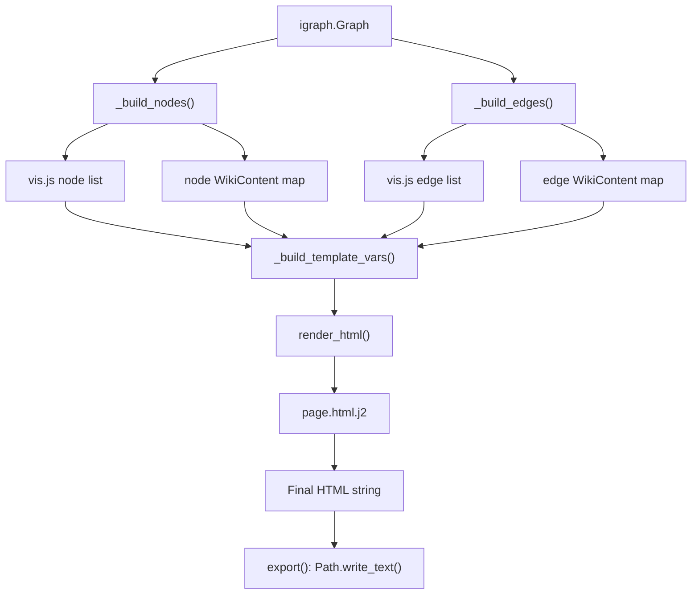
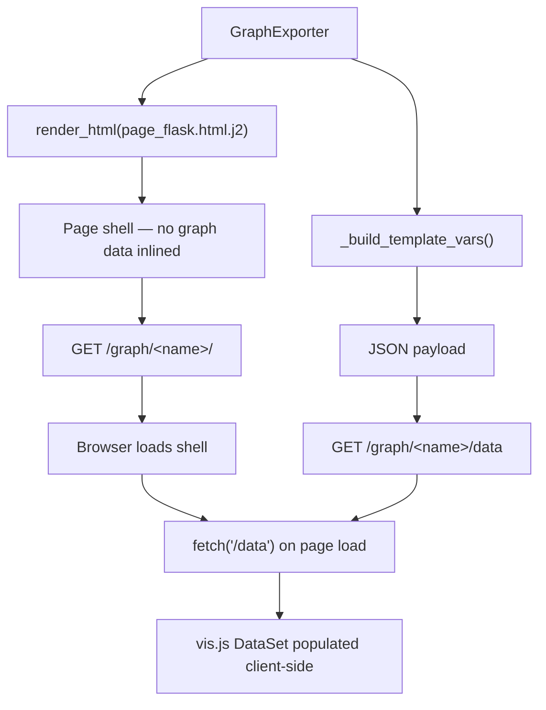

# Architecture

## Component Responsibilities

| Component | Responsibility |
| --------- | -------------- |
| `GraphExporter` | Orchestrates node/edge styling, wiki rendering, HTML output |
| `GraphView` | Flask Blueprint wrapping one or more exporters for HTTP serving |
| `NodeStyle` / `EdgeStyle` | Dataclasses mapping Python styles to vis.js options |
| `WikiContent` / `WikiTemplateRenderer` | Wiki content model and Jinja2 template resolution |
| `LayoutConfig` | Vis.js physics/layout configuration |
| `ThemeConfig` | Bootstrap/Bootswatch theme metadata |

## Data Flow — Static Export

`_build_template_vars()` is the single place that turns Python graph data into the dict consumed by Jinja2 — both `export()` and `GraphView` go through it, so the two serving modes never duplicate the data-assembly logic.

## Data Flow — Flask Serving

The Flask shell (`page_flask.html.j2`) differs from the static page (`page.html.j2`) in one key way: it doesn't inline graph data as JavaScript constants. Instead it fetches `/graph/<name>/data` on load, which lets `GraphView` swap graphs without a full page reload and lets factory-based graphs (see [Flask Integration](../tutorial/flask.md#dynamic-graphs)) rebuild fresh data on every request.

## Extension Points

- **Style callbacks** — `node_style_callback` / `edge_style_callback` for per-element customization
- **Wiki callbacks/renderer** — `wiki_callback`, `edge_wiki_callback`, or `WikiTemplateRenderer` for custom content
- **Custom Jinja2 templates** — override any bundled template by name via `template_dir`; see the [template resolution order](../user-guide/templates.md#template-resolution-order)
- **Flask factory pattern** — pass a zero-argument callable instead of an exporter to `GraphView.add()` for live data feeds that rebuild on each request
