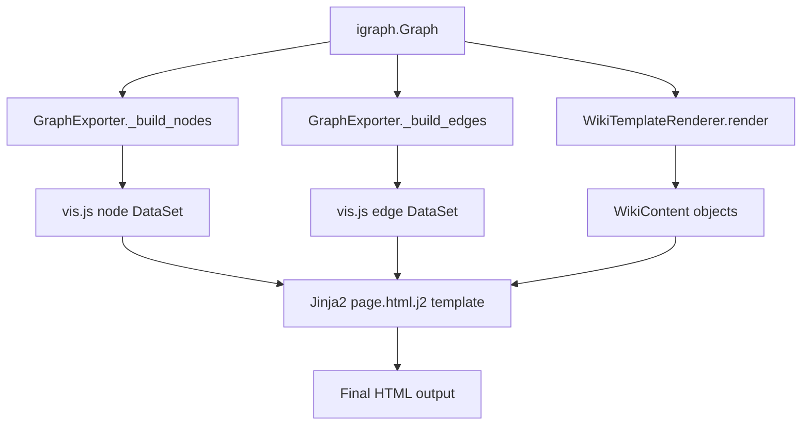

# Architecture

## Component Responsibilities

| Component | Responsibility |
| --------- | -------------- |
| `GraphExporter` | Orchestrates node/edge styling, wiki rendering, HTML output |
| `GraphView` | Flask Blueprint wrapping exporters for HTTP serving |
| `NodeStyle` / `EdgeStyle` | Dataclasses mapping Python styles to vis.js options |
| `WikiTemplateRenderer` | Jinja2 environment managing template resolution |
| `LayoutConfig` | Vis.js physics/layout configuration |
| `ThemeConfig` | Bootstrap/Bootswatch theme metadata |

## Data Flow

## Extension Points

- Style callbacks for per-element customization
- Wiki callbacks/renderer for custom content
- Custom Jinja2 template inheritance
- Flask factory pattern for live data feeds
